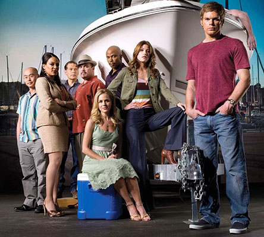

# Nathalia Lima HW #2
This repo is for homework 2 - Character build (CSS selection and styles)

___

## Theme: TV series Dexter

This series is very interesting despite seeming very violent (which it is).

I've always liked the theme of the series, because it helps us understand people's minds a little better.

All images are from the websites:
[Dexter Fandom](https://dexter.fandom.com/wiki/Category:Characters "Dexter Fandom")
and 
[Wikipedia](https://en.m.wikipedia.org/wiki/File:Dexter_2006_logo.svg "Wikipedia")

___

## Installation

No installation required

## Usage

Open page index.html in your browser and enjoy!

## Contributing

1. Fork it!
2. Create your feature branch: `git checkout -b my-new-feature`
3. Commit your changesL `git commit -am 'Add some feature'`
4. Push to the branch: `git push origin my-new-feature`
5. Submit a pull request :D

## History

November 09th, 2023

## Credits

Nathalia Lima

## License

MIT License